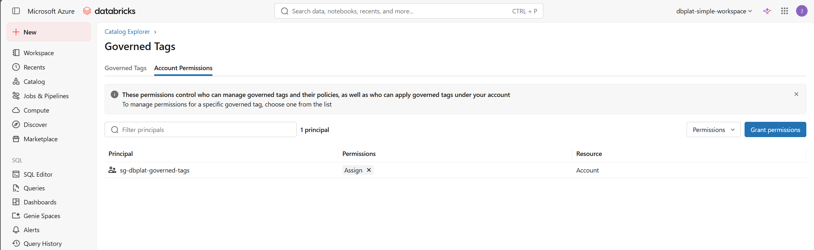

# Governed tag ASSIGN grants — manual setup

Databricks governed tag permissions cannot be configured via the REST API or Terraform. After every fresh `terraform apply` (which creates a new Unity Catalog metastore), you must grant `ASSIGN` at the account level — one grant that covers all governed tags.

## When to run this

After each `terraform apply` that creates or recreates the metastore. If you destroy and redeploy (the normal cycle for this repo), the metastore is new and all tag permissions are reset — run this step again.

Data Classification must already be enabled on silver and gold before the governed tags exist — check Catalog → Govern → Data Classification if you haven't confirmed it's on for this workspace.

## Steps

Grant `ASSIGN` to `sg-dbplat-governed-tags` via **Catalog → Govern → Governed Tags → Account Permissions → Grant permissions** — one grant at account level covers every governed tag.

## Principal

| Principal | Type | Covers |
|---|---|---|
| `sg-dbplat-governed-tags` | Entra security group | Nests `sg-dbplat-data-product-sps` (all domain team SPs) and `sg-dbplat-data-stewards` |

When a new team is added and `terraform apply` runs, the new SP joins `sg-dbplat-data-product-sps`, which is already nested inside `sg-dbplat-governed-tags` — no re-grant is needed.

## Why this cannot be automated

Databricks has not implemented governed tag permission management in either the REST API or the SDK. There is no programmatic way to grant or revoke `ASSIGN` — it must be applied manually by a user with metastore admin rights.
