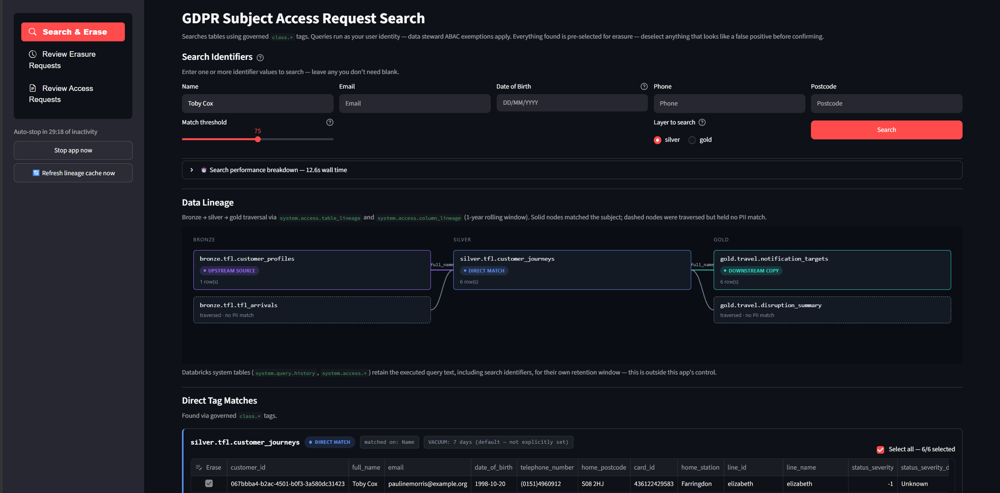
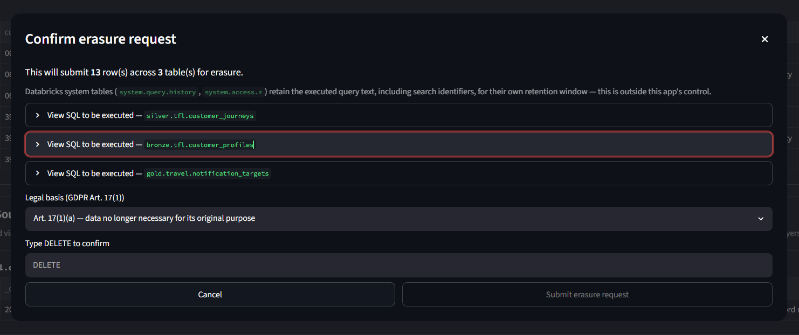
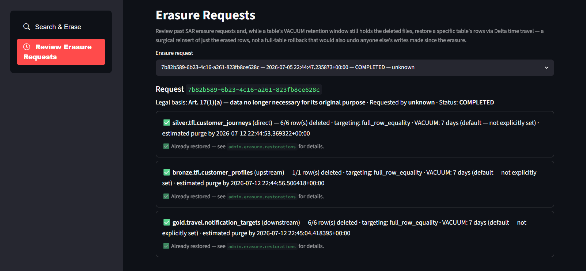
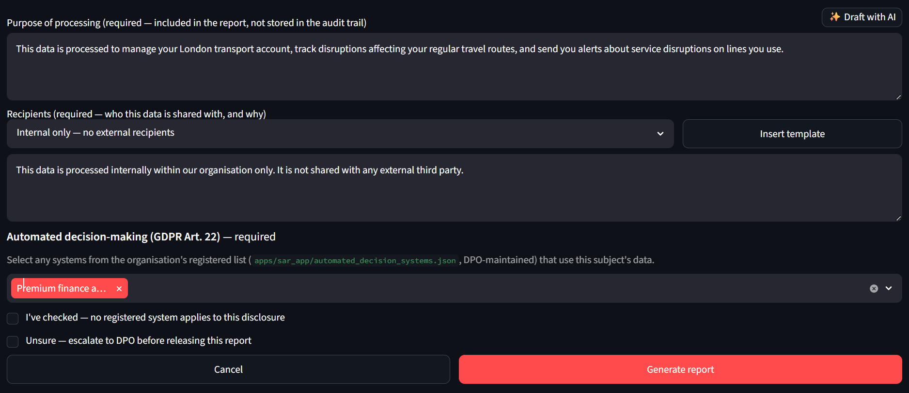
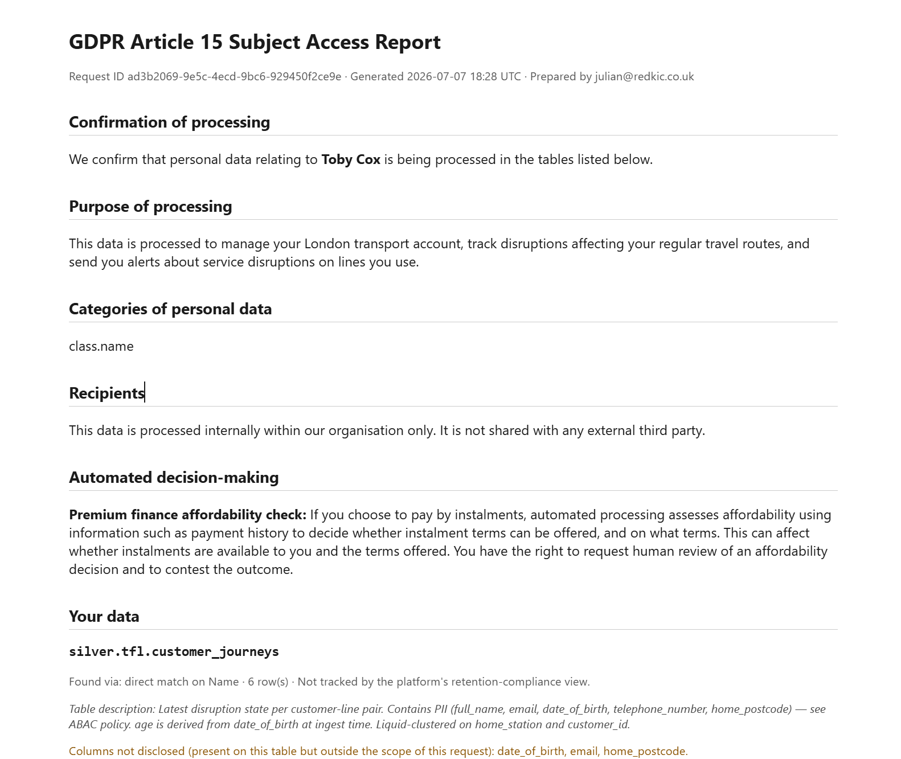

# GDPR Subject Access Request (SAR) search and erasure



> **Proof of concept.** This app exists to demonstrate what's buildable on Databricks Apps — Unity Catalog lineage and governance, the Foundation Model API, and a production-grade UI, all as one deployable unit. GDPR Subject Access Requests were chosen as a realistic, compliance-heavy use case to prove it against, not because this is a shipped compliance product.

The `platform-sar-app` Databricks App (`apps/sar_app/`) is a three-page tool for handling GDPR Subject Access Requests end to end: find every copy of a subject's data across the lakehouse, generate an Article 15 access report or review and confirm Article 17 erasure, and — if needed — undo an erasure while the underlying table's VACUUM retention window still holds the deleted files. It's a Streamlit app with a sidebar page switcher (`streamlit-option-menu`): **Search & Erase**, **Review Erasure Requests**, and **Review Access Requests**.

| Feature | What it does |
|---|---|
| [Lineage-aware search](#search--erase) | Traces a subject across bronze → silver → gold automatically, not just one table |
| [Erasure with time-travel restore](#review-erasure-requests--time-travel-restore) | All-or-nothing delete, undoable via Delta time travel while the VACUUM retention window holds |
| [AI-drafted purpose of processing](#ai-drafted-purpose) | Databricks Foundation Model API drafts from schema metadata only, never the disclosed data itself |
| [Automated decision-making register](#automated-decision-making-art-22) | DPO-maintained register with a hard gate — the report can't be generated with this silently unanswered |
| [Recipients with template picker](#recipients) | Required free text, with pre-written phrasing templates for consistency |
| [Idle auto-stop](#idle-auto-stop) | Stops its own compute after inactivity — no cost left running between demos |

## Search & Erase

Search identifiers (Name, Email, Date of Birth, Phone, Postcode/Location) live on the main page rather than the sidebar, laid out across columns so all five are visible without scrolling; the "Layer to search" radio and Search button share the same row-band as the Name column's match-threshold slider, reusing space that would otherwise sit empty under the other four fields. Any field left blank is simply not searched — there's no separate "enable this identifier" checkbox.

Enter one or more values and click **Search**. Queries run under the calling user's own identity — data steward ABAC exemptions apply — against a chosen layer (bronze, silver, or gold; silver by default). When multiple identifiers are given, a row must satisfy all of the identifiers tagged on its own table; a table missing one of the selected identifiers is still searched on whichever it does have, since PII fields are often split across tables. Name search strips honorifics, expands nicknames (via the `nicknames` library), and ranks results by `WRatio` fuzzy score against an adjustable match threshold. Phone search normalises to the last 9 digits so any country-code prefix (`+44`, `0044`, …) still matches.

After a silver/gold search finds matches, the app automatically traces lineage in both directions to find every other copy of the subject's data:

- **Upstream to bronze** — column lineage traced via BFS (up to 10 hops), then those bronze tables are searched for the same subject. Bronze queries run as the app's own service principal rather than the calling user, since users don't have `SELECT` on bronze by design and bronze columns don't carry governed tags.
- **Downstream copies** — the same column-lineage mechanism traces forward, catching derived tables that don't carry the original `class.*` tags. Column lineage carries the original tag and search value through intermediate hops, so the correct search conditions arrive at each table regardless of how many transformation steps sit between them.

Both the table-level lineage graph and the two column-lineage traces read from a small pre-computed cache rather than Databricks' raw lineage system tables directly — see [Lineage cache](#lineage-cache) below — and the four queries run concurrently rather than one after another, since none of them depend on each other's results.

Results render as a custom lineage map (bronze → silver → gold, solid nodes for matches, dashed for traversed-but-no-match) plus one review card per matched table, colour-coded to match the lineage map (blue = direct match, violet = upstream source, teal = downstream copy). Clicking a matched lineage node scrolls the page to its corresponding card. Every found row is pre-selected for erasure in an editable table — deselect anything that looks like a false positive before confirming.

The results table's built-in "Download as CSV" toolbar button is hidden via a small CSS block targeting its `aria-label` (Streamlit has no public API to disable just that one button — [streamlit/streamlit#8402](https://github.com/streamlit/streamlit/issues/8402) — so this pins against the internal DOM structure of Streamlit 1.58.0 specifically, and may need revisiting on a future upgrade). That closes off incidental bulk export during ordinary browsing; it isn't meant to block the one deliberate, reviewed, purpose-justified export path this app does provide — the access report below.

Below the results, a radio choice — "What would you like to do with these results?" — followed by a single **Continue** button, picks between the two GDPR rights this app can act on: **Generate an Art. 15 access report** and **Process an Art. 17 erasure request**. They're deliberately presented as two equal-weight options rather than one primary button and one secondary one, since neither right takes precedence over the other. Choosing erasure opens a dialog showing the exact `DELETE` SQL for each table (on-screen only, never persisted), a GDPR Art. 17(1) legal basis selector, and a typed `DELETE` confirmation — Continue is disabled until at least one row is selected. Choosing the access report covers every row found above regardless of the erasure checkboxes — a subject's right of access isn't conditioned on what's marked for erasure — and is documented separately below.



### Erasure execution — all-or-nothing, no native transactions

Erasure runs as the app's own service principal — escalated beyond the calling user's privileges, since no single non-admin principal has delete rights across every team's tables.

Execution is **all-or-nothing across every table in the request**:

- Every target's delete predicate is dry-run (`SELECT COUNT(*)`) *before* any table is actually deleted.
- Only if every single dry-run matches its expected row count does any `DELETE` run at all.
- A mismatch on one table aborts the whole request without touching any other table.

This can't be achieved with native Databricks multi-statement transactions here, since tables with row filters/column masks (which silver and gold both have, for ABAC) [cannot participate in a transaction at all](https://docs.databricks.com/aws/en/transactions/).

Row targeting uses the table's Unity Catalog primary key if one is declared, otherwise falls back to full-row equality across every column. Building the equality predicate is more subtle than it looks — see `apps/sar_app/erasure.py`'s `_sql_literal`/`_sql_string`/`_sql_timestamp`: TIMESTAMP columns need microsecond precision preserved (a literal truncated to whole seconds silently never matches a real value with sub-second precision), and string literals need backslashes escaped before quotes (Databricks SQL string literals process C-style escape sequences like `\n`/`\uXXXX`, so unescaped backslashes in free text or JSON blobs get reinterpreted into different characters than what's actually stored, breaking the comparison). Both were real bugs found by testing against live data, not hypothetical.

### Audit trail — `admin.erasure`

Every request writes to `admin.erasure` (owned by the `data_platform_admins` team, same Terraform mechanism as any domain team's schemas — see the infra repo's `terraform/data-product-teams.tf` + `terraform/catalogs.tf: databricks_grants.admin_erasure`):

| Table | Purpose |
|---|---|
| `requests` | One row per erasure case: hashed subject reference, requester, legal basis, overall status (`COMPLETED`/`PARTIAL`/`ABORTED`/`FAILED`) |
| `request_items` | One row per (request, affected table): rows selected/deleted, row-targeting method, hashed row keys, VACUUM retention, execution status (`SUCCEEDED`/`FAILED`/`SKIPPED`/`ABORTED`) |
| `restorations` | One row per restore *attempt* against a request_item (see below) |

This is evidence that erasure happened, never a copy of the erased data — subject and row identifiers are always hashed via `admin.shared.hash_subject_ref`/`hash_row_key` before being persisted, never stored as plaintext, and the executed DELETE/INSERT statements themselves are never persisted (only shown on-screen for review). Grants are Terraform-only and narrow: the platform team's SP for writes, data stewards for read-only review — there's no `GRANT ... TO account users` the way dashboard-facing views get.

## Lineage cache

`system.access.table_lineage`/`column_lineage` are account-wide, append-only event logs: a pipeline running daily for a year leaves ~365 rows for the same structural edge. The app used to re-aggregate those raw logs from scratch on every search — scanning up to a year of history per query, several seconds each even against this repo's small demo workspace — which doesn't scale to a real deployment with many pipelines and a full year of history. Instead, two tables in `admin.lineage_cache` (`table_lineage_current`, `column_lineage_current`) hold one row per distinct edge *ever observed*, deduplicated — the app's lineage queries (`apps/sar_app/lineage.py`) read from these instead of the raw system tables, with no date filtering or aggregation needed at query time since the cache is already deduplicated by construction.

The cache is refreshed **incrementally**, not by re-scanning full history each time: `governance/refresh_lineage_cache.sql` `MERGE`s only a recent rolling window (default 30 days, `lineage_cache_lookback_days` job parameter) of the raw system tables into the cache tables, keeping the refresh job's own cost roughly constant over time regardless of how much raw history accumulates. This SQL file lives in exactly one place and is owned by a standalone job, `lineage_cache_refresh` (`resources/jobs/lineage_cache_refresh.yml`) — **not** duplicated into the app's Python. Two things trigger it:

- **`governance_daily`'s schedule** — a `run_job_task` in `resources/jobs/governance.yml` triggers `lineage_cache_refresh` rather than running the SQL inline. `governance_daily` is **paused by default in demo environments**; unpause it in the Databricks UI for the cache to stay fresh automatically.
- **The sidebar's 🔄 Refresh lineage cache now button** — for a steward who knows a relevant pipeline ran very recently and doesn't want to wait for the next scheduled refresh before an urgent search. `apps/sar_app/lineage.py: trigger_lineage_cache_refresh` calls `WorkspaceClient().jobs.run_now(...)` on the same job and waits for it to finish (up to 3 minutes) rather than re-implementing the MERGE — this only resolves inside a deployed app (`LINEAGE_CACHE_REFRESH_JOB_ID` env var, wired via `app.yaml`'s `valueFrom: 'lineage-cache-refresh-job'` binding to a `job` resource declared in `resources/apps/sar.yml`, the same pattern `DATABRICKS_WAREHOUSE_ID` already uses for the SQL warehouse), not under local `apps run-local`.

On first deploy against a workspace with lineage history older than the default 30-day window, run the job once manually with a wider value to backfill it — "Run now with different parameters" in the Jobs UI, or `databricks bundle run lineage_cache_refresh --params lineage_cache_lookback_days=400`.

**Staleness trade-off**: a brand-new lineage edge won't appear in search results until the next refresh. Lineage structure — which tables feed which — changes on the order of days/weeks in practice, not intraday, so this is accepted rather than re-scanning a year of account-wide event logs on every interactive search.

Since triggering a job run and reading `admin.lineage_cache` are the only two things the app needs, its access footprint stays narrow: the `resources/apps/sar.yml` job resource declaration grants the app `CAN_MANAGE_RUN` on `lineage_cache_refresh` specifically (not broader Jobs access), and the infra repo's `terraform/catalogs.tf: databricks_grants.admin_lineage_cache` grants the app SP `SELECT` only — never `MODIFY`, and never any access to `system.access.*` at all, since the actual write happens under the triggered job's own run-as identity, not the app's. Grants otherwise mirror `admin_erasure`/`admin_access`: the platform team's SP owns the schema, data stewards get read-only access.

The four lineage queries a search makes — table-lineage upstream, table-lineage downstream, column-lineage upstream trace, column-lineage downstream trace — are independent of each other and run **concurrently** (`concurrent.futures.ThreadPoolExecutor`, each on its own connection, since a single `DatabricksClient`'s SQL connection isn't safe to share across threads), turning their combined cost into roughly the slowest single one instead of their sum. A collapsed-by-default "⏱️ Search performance breakdown" expander on the results page shows per-phase and per-table timings for diagnosing where a slow search is actually spending its time.

## Review Erasure Requests — time-travel restore



The second page lists past requests and their per-table items, and lets a reviewer restore a `SUCCEEDED` table's rows via Delta time travel while its VACUUM retention window still holds the physical files.

Restore is a **surgical row reinsert, not `RESTORE TABLE`**: `RESTORE TABLE ... TIMESTAMP AS OF` rolls the entire table back to a prior version, which on a shared data-mesh table would silently revert any other team's writes made since the erasure too — not just the one request being undone. Instead: `find_pre_delete_version` correlates the request_item's recorded `executed_at` against the table's own `DESCRIBE HISTORY` to locate the DELETE operation (shown to the reviewer for a sanity check, including Delta's own `numDeletedRows` metric when available), time-travels to the version just before it, recomputes `hash_row_key(...)` for every row in that historical snapshot using the *exact same Python function* the original delete used to hash the rows it removed, keeps only the ones whose hash is already in the stored `row_key_hash` array, and inserts just those back. Reusing that one hashing function on both sides (rather than reimplementing the canonical-key join in SQL) is what keeps the two sides from drifting out of format sync — the same class of bug as the timestamp/backslash issues above would otherwise resurface here too.

Restoring requires typing `RESTORE`, selecting a reason, and (like erasure execution) runs as the app's own service principal. Each attempt is logged to `admin.erasure.restorations`, including which Delta version was actually read from, and an already-successfully-restored item shows "Already restored" instead of a button (preventing duplicate reinsertion).

## Access Reports (Art.15)

The app's original name — "GDPR Subject Access Request search and erasure" — was always slightly wrong: a genuine Subject Access Request is Article 15 (right of access, a *report* of the subject's data), while everything above is Article 17 (right to erasure). **Generate Art. 15 access report**, next to the erasure button on the Search & Erase page, closes that gap using the exact same search/lineage results already on screen — no separate search step, no new lakehouse read grants, since it only ever renders rows already fetched by the search pipeline.



### Column redaction review

A row matching the subject's search identifiers can still carry a *different* subject's personal data in another column — a shared booking row is the canonical example. The app cannot reliably tell "the subject's own other PII field" apart from "a different subject's PII in the same row," so it never auto-redacts. Instead, clicking the button pulls every `class.*`-tagged column present on each matched table (not just the ones the search matched against) and presents a per-column checklist, pre-checked for columns tagged with an identifier the search actually looked for (or untagged, non-governed columns) and pre-*unchecked* for any other governed column, with its tag shown so the reviewer can judge it before including it. Table and column `COMMENT` metadata (Unity Catalog `information_schema.tables`/`columns`) is shown alongside as drafting context — useful when set, but never a substitute for the reviewer's own judgment, since pipeline authors may not have set comments or may have stale ones.

### AI-drafted purpose

The "Purpose of processing" field is required free text with no purpose/recipient registry in this platform to auto-derive it from — a genuine burden on the reviewer for a table they may not own. A "✨ Draft with AI" button above the field calls `databricks-claude-haiku-4-5` (a Databricks Foundation Model API pay-per-token endpoint — Haiku is deliberately the cheapest tier here, since this is a short, simple, low-stakes drafting task that's always human-reviewed before use; granted `CAN_QUERY` to the app SP via a `serving_endpoint` resource in `resources/apps/sar.yml`, surfaced to the app as `PURPOSE_DRAFT_ENDPOINT`) to draft a short starting-point statement. The prompt (`access_report.draft_purpose`) is built strictly from schema-level facts already on screen for the reviewer's own redaction review — table names, table/column `COMMENT`s, matched governed tag, provenance, and only the columns currently checked `Include` — and never the disclosed rows themselves; see the reasoning in "Report format" below for why that boundary matters. The result only ever prefills the still-editable text box, exactly like Unity Catalog's own "Generate a comment" AI assist for column/table comments — the reviewer can edit it, regenerate it, or ignore it, and it's never submitted automatically.

### Recipients

Required free text, right below Purpose of processing, same reasoning — an organisation's actual recipients (reinsurers, outsourced claims administrators, cloud vendors, fraud-prevention databases, and the like) live entirely outside what this platform can observe, so there's no AI-draft button here: there's nothing for a drafting prompt to draw from that wouldn't risk inventing a third party that isn't real. This is a deliberately different mechanism from the Automated decision-making register below: recipients disclosure (Art. 15(1)(c)) is a factual "who and why" answer the reviewer already knows, closer in kind to Purpose, whereas Art. 22 disclosure requires specific pre-approved legal language about logic/significance/consequences that a reviewer shouldn't improvise. Since the 2023 CJEU ruling in *Österreichische Post* (C-154/21), Art. 15(1)(c) generally requires naming the actual recipient rather than only a category, and any recipient outside the UK/EEA needs its transfer safeguard (adequacy decision, Standard Contractual Clauses, etc.) stated too — both are the reviewer's responsibility to get right here, same as the field's content generally.

A template picker above the field (backed by `apps/sar_app/recipient_templates.json`, editable via PR like the Automated decision-making register) inserts pre-written phrasing with `[bracketed blanks]` for the reviewer to fill in — a pure drafting aid for grammar/tone/legal-phrasing consistency across reports, not a claim about what the organisation actually does. Selecting a template appends it to whatever's already in the box (so multiple recipients can be built up from several templates), and the field stays fully editable either way; nothing is inserted without the reviewer clicking "Insert template".

### Automated decision-making (Art. 22)

Art. 13(2)(f)/14(2)(g)/15(1)(h) all require "meaningful information about the logic involved, as well as the significance and the envisaged consequences" of any solely-automated decision-making with legal or similarly significant effect. This platform has no way to discover that on its own — Unity Catalog/MLflow lineage stops at the platform boundary, a single table can feed several unrelated automated systems with different consequences for the subject, and the team that understands a given system's logic usually isn't the team that owns the underlying table (see the design discussion this grew out of for the full reasoning). So this is deliberately **not** solved with a tag or an auto-derived registry.

Instead, `apps/sar_app/automated_decision_systems.json` is a DPO-maintained register — edited directly via a PR, no code change or Databricks access needed — of the organisation's known automated decision-making systems, each with pre-approved subject-facing `statement`/`safeguards_text` fields. The shipped register models 12 systems spanning pricing, underwriting, fraud, claims, and enforcement, each also carrying its own `solely_automated`, `human_review_exists`, and `legal_or_significant_effect` flags — several entries honestly flag the ambiguous case ("confirm this holds for every case before using this entry") rather than assuming Art. 22 does or doesn't apply by default.

In the access report dialog, the reviewer picks (manually, never auto-matched — a wrong attribution in either direction is a compliance-relevant mistake a human should make deliberately) which registered systems apply to this disclosure from a multiselect. This section is required, with no unanswered default: the reviewer must either select one or more systems, explicitly check **"I've checked — no registered system applies"**, or check **"Unsure — escalate to DPO before releasing this report"** (which, like an unresolved contradiction between the other two checkboxes, hard-blocks report generation) — leaving the section untouched blocks generation the same way an empty Purpose of processing field does, so a reviewer can't silently skip past it the way the old hardcoded boilerplate silently skipped past it for every report. An incomplete Art. 15 response is treated as a compliance failure in its own right, not a lesser evil than a delay. `access_report.build_report` renders each selected system's own statement verbatim; with none selected (and "none apply" confirmed), it falls back to `AUTOMATED_DECISION_NONE_TEXT`, which is deliberately scoped to "no *registered* system applies" rather than a blanket "none exists" claim, since the register may be incomplete.

Every entry needs validating against what the named system actually does before use, and kept in step with Recital 63 (the logic summary must stay general enough not to disclose trade secrets/model internals) and with whether a described "human review" is genuinely meaningful — a rubber-stamp review still counts as solely automated under CJEU/EDPB positions. None of that is enforced by the platform; it's why this is a DPO-owned file, not a developer-owned one.

### Report format — printable HTML, not JSON or a PDF library



The generated document is a single self-contained HTML file (inline CSS, a `@media print` stylesheet) rather than raw JSON or a PDF-generation dependency. A subject-facing disclosure needs to actually be readable, and the reviewer can open the downloaded file in a real browser tab and use Print → Save as PDF for a handoff-ready copy — no PDF library for this app to maintain.

It covers Art. 15(1)'s required disclosures: confirmation of processing, purpose (the reviewer's required free-text entry — there's no purpose registry in this platform to auto-derive it from), categories of personal data (from the matched `class.*` tags), recipients (also required free text, same reasoning as purpose — this platform has no reliable way to enumerate an organisation's actual third parties, e.g. reinsurers, outsourced processors, cloud vendors, and a wrong guess here is worse than requiring the reviewer to know the answer; note that since the 2023 CJEU ruling in *Österreichische Post* (C-154/21), Art. 15(1)(c) generally requires naming the actual recipient, not just a category, and any recipient outside the UK/EEA needs its transfer safeguard stated too — neither of which this platform can derive on its own), retention (per table, from `admin.shared.retention_compliance`'s `has_delete_at`/`freshness_sla` — deliberately not the erasure feature's VACUUM retention, which is a different concept: how long a *deleted* row's files survive, not a live row's retention policy), automated decision-making (the reviewer's selection from the DPO-maintained register — see above), and the subject's other rights (rectification, erasure, restriction, objection, portability, complaint to a supervisory authority).

Redacted columns are dropped from the report entirely, not masked — Art. 15(4) is about not disclosing another person's data, not about showing a placeholder.

This build deliberately keeps the document generation itself fully template-based and deterministic — no LLM in the `build_report` path, for the same schema-only-vs-actual-data boundary described under "AI-drafted purpose" above. Feeding the *disclosed rows themselves* to an LLM would create a new processing purpose and a new recipient (the model provider) needing its own disclosure under Art. 15(1)(c), and risks hallucinating facts into a document meant to be an accurate legal record — so the report's actual assembly never touches a model.

Same reasoning as the "Download as CSV" CSS block above: that block stops *incidental* PII export during ordinary browsing, not a deliberate, reviewed, purpose-justified disclosure, which is the one legitimate export path this feature exists to provide. Unlike erasure, generating a report isn't gated behind a typed confirmation — it's not a destructive action, so the column-redaction review and required purpose field are the safeguards, not a "type X to proceed" step.

Clicking "Generate report" also triggers the browser's save dialog automatically — a hidden auto-clicked `<a download>` link (`components.html`, one-shot via `sar_access_auto_download` in session state so it fires exactly once per generation, not on every later rerun) rather than requiring a second manual click on the "Download report (.html)" button below it, which stays as a fallback in case a browser's download-blocking settings suppress the automatic one.

### Audit trail — `admin.access`

Every generated report writes to `admin.access` (same ownership/grant pattern as `admin.erasure` — see the infra repo's `terraform/catalogs.tf: databricks_grants.admin_access`):

| Table | Purpose |
|---|---|
| `requests` | One row per access-report case: hashed subject reference, requester, overall status |
| `request_items` | One row per (request, source table): rows disclosed, columns included/redacted, hashed row keys |

Same "evidence, never a copy" principle as erasure: `admin.shared.hash_access_subject_ref`/`hash_access_row_key` (their own versioned salts, distinct from erasure's, so a hash here can't be mistaken for one erasure produced) hash the subject reference and row keys before persisting, and the generated report document itself is never stored server-side — it only ever exists as the reviewer's one-time download. There's no restorations-equivalent table; a disclosure has nothing to undo.

### Review Access Requests

The third sidebar page lists past access requests and their per-table items — read-only, no restore action, since there's nothing to undo. It adds one Art. 12(3) compliance aid the erasure review page doesn't need: a one-month response-deadline badge per request (on-time / overdue), computed from `requested_at`/`completed_at`, since this is exactly where a DPO would check SLA compliance.

### Explicitly out of scope for this pass

Article 12(5)'s "manifestly unfounded or excessive" refusal ground and an automated purpose/recipient inventory are deliberately not built — neither blocks a correct, minimal Art. 15 disclosure path, and building them ahead of a real requirement risks over-engineering a feature that, like erasure before it, is meant to grow incrementally.

## Idle auto-stop

Databricks Apps bill per hour while running and have no built-in scale-to-zero, so a rarely-used app left running racks up cost unattended. The app stops its own compute after `IDLE_TIMEOUT_MINUTES` (env var in `apps/sar_app/app.yaml`, default 30) since the last completed search, via a background watchdog using the app's own service principal (granted `CAN_MANAGE` on itself in `resources/apps/sar.yml`). A live countdown and a "Stop app now" button are shown in the sidebar for stopping it immediately instead of waiting out the timeout. Because the app can now be stopped between uses, the CI deploy workflow explicitly runs `databricks apps start platform-sar-app` before redeploying source code.

## Access

Restricted to `sg-dbplat-data-stewards` and `sg-dbplat-data-platform-admins`.

## Access grants for bronze/silver/gold and admin.*

The app SP needs `USE_CATALOG`/`USE_SCHEMA`/`SELECT`/`MODIFY` on bronze, silver, and gold alike, `EXECUTE` on `admin.shared` (to call the hash UDFs), `SELECT`/`MODIFY` on `admin.erasure` and `admin.access`, `SELECT`-only on `admin.lineage_cache` (writes go through the `lineage_cache_refresh` job's own identity — see [Lineage cache](#lineage-cache) — not the app SP), and `USE_CATALOG` on `system` plus `USE_SCHEMA` on `system.information_schema`. `CAN_USE` on the platform SQL warehouse is granted separately, declared directly on the app resource in `resources/apps/sar.yml`.

The `system`/`system.information_schema` grant exists because `<catalog>.information_schema.column_tags` is backed by data owned by the `SYSTEM` catalog — reading it (the search pipeline's tag catalogue scan, and the access-report redaction review's per-table tag lookup) needs `USE CATALOG` on `system` no matter which catalog it's queried from. Both call sites (`database.get_tagged_columns`, `access_report.get_all_tagged_columns`) run on the app's own SP token (`get_service_principal_token()`), not the calling user's, so ordinary searchers never need direct access to `system` tables like `system.access.audit` — only tag metadata (which columns carry which `class.*` tag) flows through the SP, never subject data, and the actual row search still runs on the caller's own token so ABAC masking stays per-user.

`MODIFY` is needed everywhere the app can find PII, including bronze via upstream lineage tracing, to actually execute a confirmed delete — an earlier bronze-is-`SELECT`-only grant meant a real erasure request found and confirmed a bronze row, then failed with `PERMISSION_DENIED` on the delete itself, since the two-phase dry-run check only exercises `SELECT` and can't catch a missing `MODIFY` grant ahead of time.

These grants are applied by `governance/grant_sar_app_access.py` (run by `governance_setup` on every deploy), which resolves the app's SP id itself via `w.apps.get(name="platform-sar-app")` rather than depending on a value handed over from the infra repo. This used to live in the infra repo's Terraform, keyed on `var.sar_app_sp_id` in `terraform/terraform.tfvars` — a value that only existed after a human manually copied the app's auto-generated SP id back there post-deploy, which broke on every fresh workspace since the SP doesn't exist until this repo deploys. `var.sar_app_sp_id` still exists in the infra repo, but now only for the SAR app SP's `sg-dbplat-data-product-sps` account-group membership (the ABAC mask-exemption group) — that one manual update-and-reapply step is still needed for the app to see unmasked data, same as before.

## Local development

The Databricks CLI's `apps run-local` command (CLI ≥ 0.250.0) runs the actual `app.py` locally against the real workspace, rather than a mock. `scripts/run-sar-app-local.ps1` wraps the setup into one command — it looks up the platform SQL warehouse and `lineage_cache_refresh` job by name directly against the live workspace (this repo has no Terraform outputs to read), starts the warehouse if it's stopped, fetches a fresh token, and launches the app:

```powershell
.\scripts\run-sar-app-local.ps1 -Profile <profile>   # -InstallDeps on first run
```

Requires a one-time `databricks auth login --host <workspace-host> -p <profile>` first. Tokens last about an hour, and a long-running `run-local` process keeps using the one it launched with — restart via the script rather than reusing a stale window.

Four things `run-local` doesn't resolve automatically outside a full bundle context, since the `valueFrom` bindings that supply them in a deployed app only work there — `DATABRICKS_WAREHOUSE_ID`, `LINEAGE_CACHE_REFRESH_JOB_ID`, and `PURPOSE_DRAFT_ENDPOINT` (a fixed literal, `databricks-claude-haiku-4-5`, rather than a per-workspace ID) are all resolved by the script above; `DATABRICKS_TOKEN` substitutes for the `x-forwarded-access-token` header the real Apps proxy injects, which also means local runs of bronze search and erasure/restore execute as *your own identity* rather than the app's SP — fine for functional testing under `data_platform_admins`, but it doesn't exercise the SP's actual grant boundary (verify that via a real CI deploy instead).

See the script's own header comment for the equivalent manual `apps run-local` invocation. If `databricks auth login` fails with a cache-format error from a leftover token cache from an older CLI version, set `DATABRICKS_AUTH_STORAGE=plaintext` before logging in to force file-based token storage instead.
